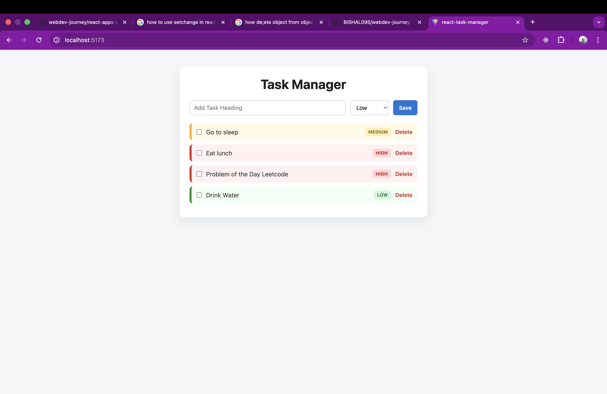
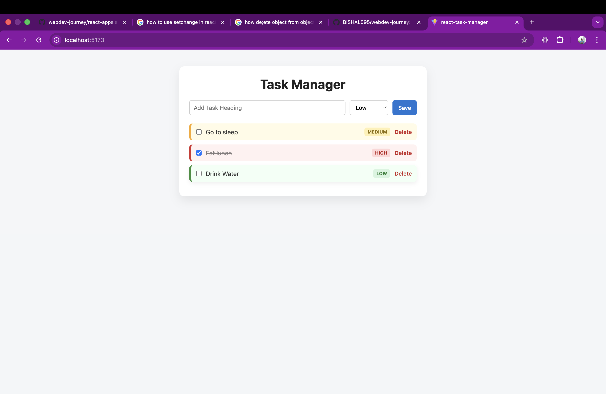

# Web Development Journey 🚀

This repository tracks my hands-on journey into modern web development, with a strong focus on building solid fundamentals before progressing into full-stack projects.

## What I’m Working On
- Following The Odin Project (Foundations → Full Stack JavaScript)
- Building projects with React
- Writing clean, semantic HTML & CSS
- Practicing modern JavaScript (ES6+)
- Maintaining consistent, meaningful Git commits

## Tech Stack
- HTML5
- CSS3
- JavaScript (ES6+)
- React
- Git & GitHub

## Repository Structure
- Concept notes (.md files)
- Practice exercises for HTML/CSS
- React-based mini projects and components
- Incremental improvements as skills evolve

## Goals
- Build strong frontend fundamentals
- Develop real-world React projects
- Maintain a clean, professional GitHub history
- Progress toward production-ready web applications

## React Task Manager

A simple React app to manage tasks with priority and localStorage.

### Features
- Add / delete / complete tasks
- Priority (High / Medium / Low)
- LocalStorage

## Live Demo
[React Task Manager Live](https://taskin-manager.vercel.app/)

📌 This repository is actively maintained and updated.